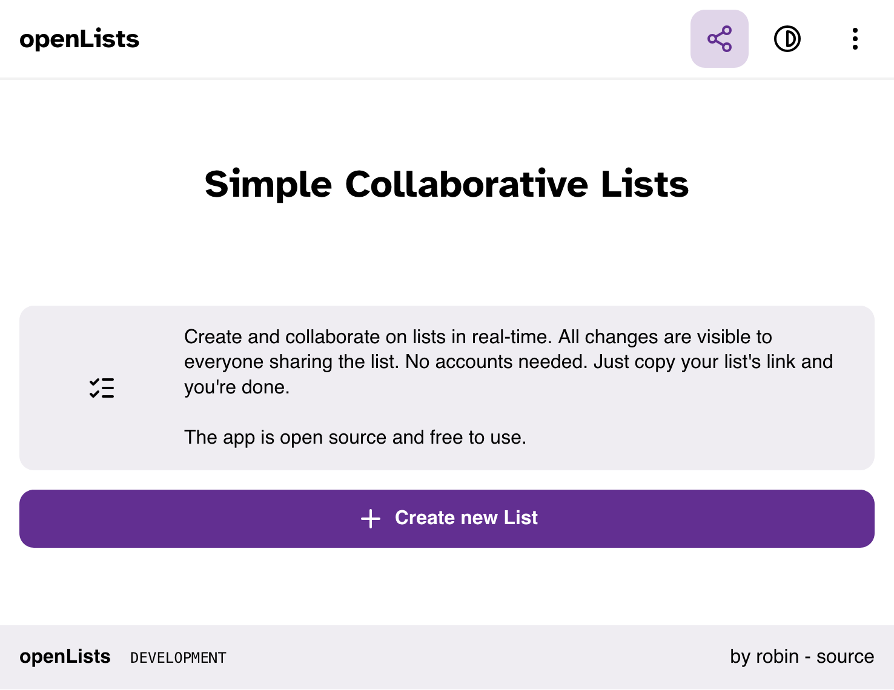
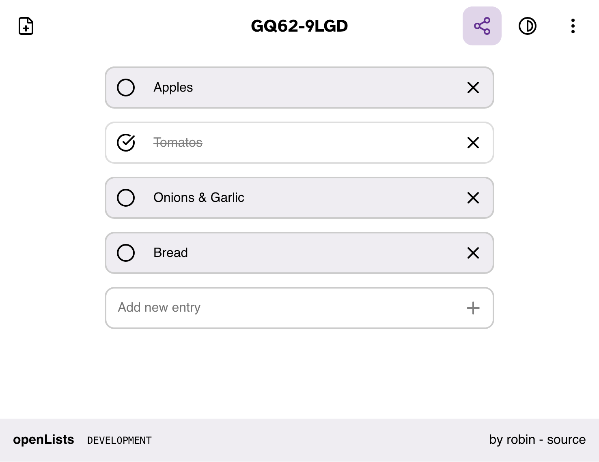

# openLists __

openLists is a self-hosted, open-source list management application built with React. It allows users to create and manage collaborative lists of items, such as tasks or shopping lists.

For an example deployment, check out this [instance](https://list.robbb.in)

### Features

- create lists directly by editing the path (e.g. /my-list)
- modity lists by adding items and marking them as done
- share lists with others by sharing the URL. No accounts or signups required.
- self-hosted and open-source, so you can run it on your own server or contribute to the project

### Screenshots

__
__

### Install

- set it up with docker-compose.
- we recommend using a reverse proxy like [traefik](https://traefik.io/) to handle SSL.

```yaml
services:
  openlists:
    image: ghcr.io/robinnaumann/open_lists:latest
    container_name: openlists
    restart: unless-stopped
    volumes:
      - ./data:/app/data # <- list data will be stored here
   labels:
      - "traefik.http.routers.openlists.rule=Host(`list.example.com`)"
      - "traefik.http.routers.openlists.entrypoints=websecure"
      - "traefik.http.routers.openlists.tls.certresolver=myresolver"
```

### contribute

- feel free to reach out if you find issues or have suggestions

Have a great day,<br>
Yours, Robin

[](https://robbb.in/donate)
